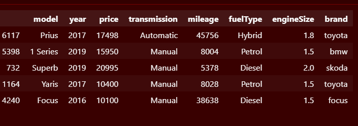
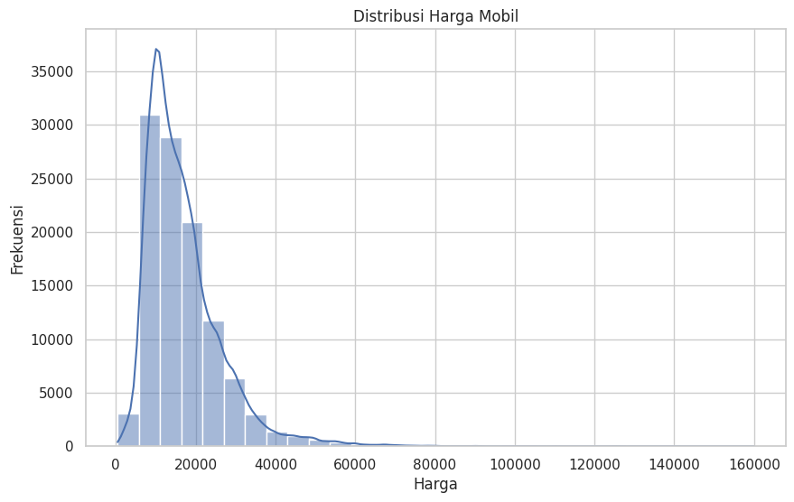
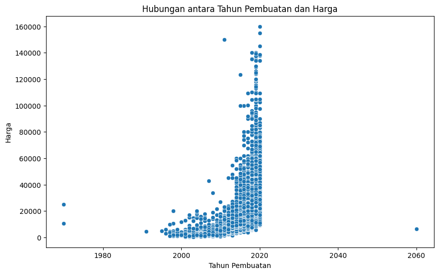

## Bernandito Galang E.J
## A11.2022.14091

## Dataset

Penjelasan Dataset, EDA, dan Proses Features Dataset
Penjelasan Dataset:
Dataset terdiri dari beberapa file CSV yang berisi informasi tentang mobil bekas dari merek Ford dan Mercedes. Kolom-kolom utama dalam dataset meliputi:

- Model
- Tahun Pembuatan (year)
- Harga (price)
- Jenis Transmisi (transmission)
- Jarak Tempuh (mileage)
- Jenis Bahan Bakar (fuelType)
- Ukuran Mesin (engineSize)
- Merek (brand)

### Exploratory Data Analysis (EDA)

- Distribusi Harga Mobil: Menggunakan histogram untuk melihat distribusi harga.
  

- Hubungan antara Tahun Pembuatan dan Harga: Menggunakan scatter plot untuk melihat hubungan antara tahun pembuatan dan harga.
  

### Proses Features Dataset

Menggabungkan dataset dari berbagai file CSV.

- `bos=pd.DataFrame()
for d in data:
    path=f"{dataset_dir}/"+d
    if "unclean" not in d:
        df=pd.read_csv(path)
        df=df[['model', 'year', 'price', 'transmission', 'mileage', 'fuelType',
       'engineSize']]
        df['brand']=d.replace(".csv", "")
        bos=pd.concat([bos,df])`

Membersihkan data dengan menghapus atau mengimputasi nilai yang hilang.

Mengubah beberapa kolom menjadi tipe data yang sesuai.

- `year_filter = df['year']!=2060
df = df[year_filter]`

## Proses Learning/Modeling

Pemodelan:

Menggunakan model regresi linier untuk memprediksi harga mobil bekas.

Melatih model dengan data yang telah dibersihkan dan diproses.

- `dfdum=dfdum.iloc[0:-1]
y=dfdum['price']
x=dfdum.drop('price', axis=1)`
- `lr=LinearRegression()
model=lr.fit(x,y)
model.score(x,y)`

## Performa Model

Evaluasi Model

- `Mean Absolute Error (MAE): 2310.37243709972`
- `Mean Squared Error (MSE): 13999076.395229207`
- `Root Mean Squared Error (RMSE): 3741.533962859245`
- `R² Score: 0.8529259517881365`

Mean Absolute Error (MAE)
Root Mean Squared Error (RMSE)
Membandingkan nilai prediksi dengan nilai sebenarnya untuk melihat seberapa baik model dalam memprediksi harga mobil bekas.

## Diskusi Hasil dan Kesimpulan

#### Diskusi Hasil

Menganalisis hasil prediksi dari model regresi linier.
Mengidentifikasi faktor-faktor yang paling berpengaruh terhadap harga mobil bekas.

#### Kesimpulan

Model regresi linier dapat digunakan untuk memprediksi harga mobil bekas dengan tingkat akurasi yang dapat diterima.
Faktor-faktor seperti tahun pembuatan, jenis transmisi, dan jarak tempuh memiliki pengaruh yang signifikan terhadap harga mobil bekas.
