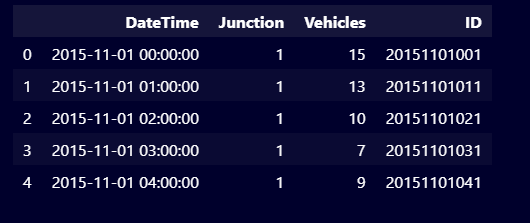
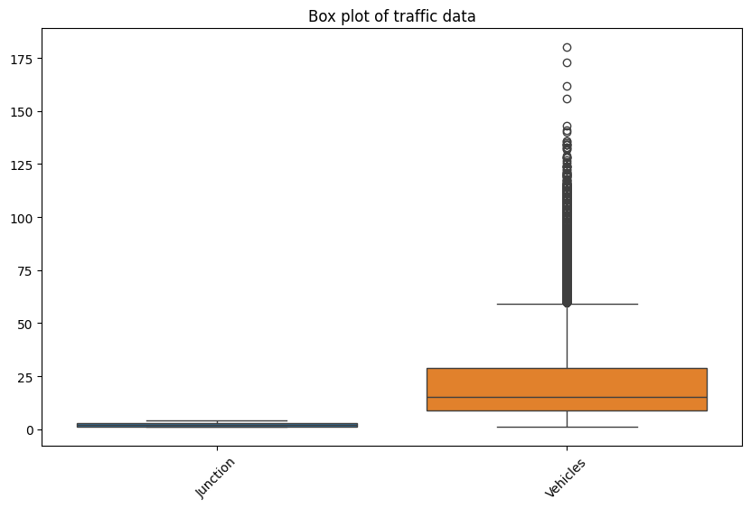
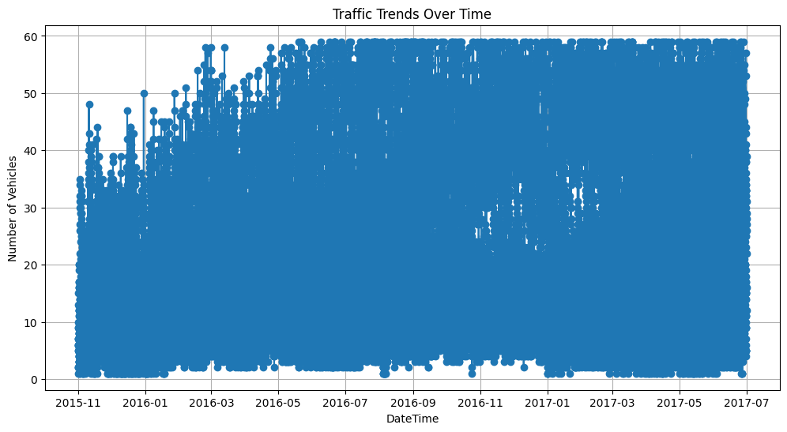
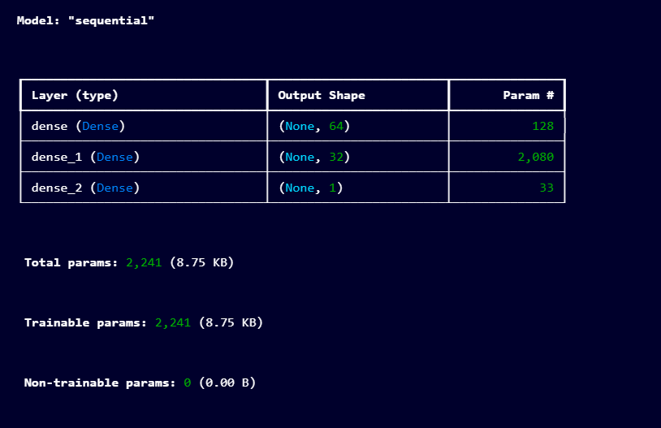
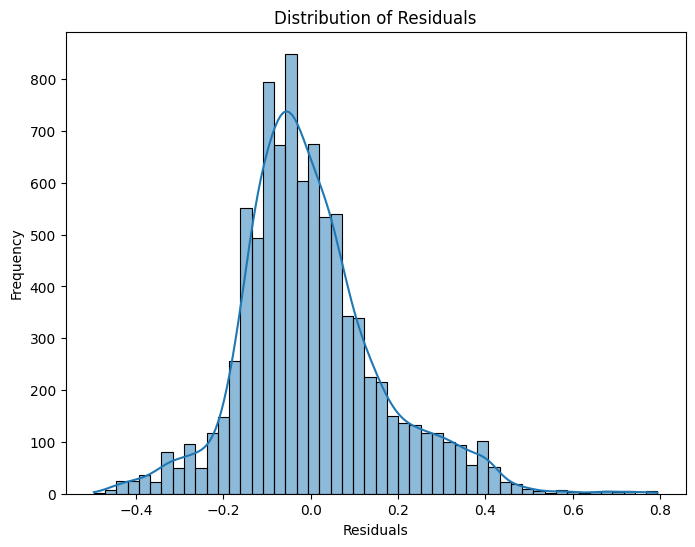

## Isyeh Rafi Maulana
## A11.2022.14060

# Prediksi Tingkat Kecelakaan Lalu Lintas

## Ringkasan dan Permasalahan

Tingginya tingkat kecelakaan lalu lintas yang disebabkan oleh berbagai faktor seperti volume kendaraan, waktu, dan lokasi. Dengan memprediksi tingkat kecelakaan, kita bisa mengimplementasikan langkah-langkah preventif yang lebih efektif.

## Tujuan

Memprediksi jumlah kendaraan pada berbagai waktu dan lokasi untuk mengidentifikasi potensi titik kecelakaan lalu lintas.

## Model

Penggunaan model regresi linier yang diperkuat dengan jaringan saraf tiruan (Neural Network).

## Alur Project

1. Pengumpulan Data : Mendownload dataset dari Kaggle.
2. Eksplorasi Data: Memvisualisasikan dan memahami data.
3. Pra-pemrosesan Data: Normalisasi dan pembersihan data.
4. Feature Engineering: Menambahkan fitur
   baru seperti jam, hari dalam seminggu,dan bulan.

5. Modeling: Membangun dan melatih model regresi dan neural network.
6. Evaluasi: Mengukur performa model dengan metrik seperti MAE dan RMSE.
7. Visualisasi Hasil: Menampilkan hasil prediksi dan residu.

## Dataset

Penjelasan Dataset, EDA dan Proses features Dataset
Dataset

- Sumber: Dataset Lalu Lintas dari Kaggle
- Deskripsi: Dataset berisi informasi tentang jumlah kendaraan yang melintasi berbagai titik selama periode waktu tertentu.

### EDA (Exploratory Data Analysis)

Memvisualisasikan distribusi jumlah kendaraan.
Menambahkan kolom fitur baru dari kolom waktu seperti jam, hari dalam seminggu, dan bulan.
Mengidentifikasi dan menangani outlier.

### Proses features Dataset

Normalisasi data menggunakan MinMaxScaler.
Membagi dataset menjadi training dan testing set.
Menggunakan fitur Polynomial untuk menambah kompleksitas model.

## Proses Learning/Modeling

1. Pra-pemrosesan Data

- Mengubah kolom waktu menjadi format datetime.
- Menambahkan kolom fitur baru (Hour, DayOfWeek, Month).

`df['Hour'] = df['DateTime'].dt.hour`

`df['DayOfWeek'] = df['DateTime'].dt.dayofweek`

`df['Month'] = df['DateTime'].dt.month`

2. Membangun Model

- Membuat model Neural Network dengan lapisan Dense.
- Menggunakan Adam optimizer dan mean_squared_error loss function.
- Menyusun model dengan arsitektur 64 neuron (relu) -> 32 neuron (relu) -> 1 neuron (output).

`degree = 2`

`poly_features = PolynomialFeatures(degree=degree)`

`X_train_poly = poly_features.fit_transform(X_train)`

`X_test_poly = poly_features.trans`

`model = Sequential([
    Dense(64, activation='relu', input_shape=(X_train.shape[1],)),
    Dense(32, activation='relu'),
    Dense(1)
])`

`model.compile(optimizer='adam', loss='mean_squared_error', metrics=['mae'])`

`model.summary()`

3. Training

- Melatih model dengan 25 epochs dan batch size 32.
- Validasi dengan 20% dari data training.

## Perfoma Model

`  Epoch 1/25
891/891 [==============================] - 3s 3ms/step - loss: 0.0291 - mae: 0.1271 - val_loss: 0.0250 - val_mae: 0.1195
Epoch 2/25
891/891 [==============================] - 2s 3ms/step - loss: 0.0255 - mae: 0.1212 - val_loss: 0.0249 - val_mae: 0.1182
Epoch 3/25
891/891 [==============================] - 3s 3ms/step - loss: 0.0254 - mae: 0.1207 - val_loss: 0.0253 - val_mae: 0.1227
Epoch 4/25
891/891 [==============================] - 4s 4ms/step - loss: 0.0254 - mae: 0.1209 - val_loss: 0.0258 - val_mae: 0.1257
Epoch 5/25
891/891 [==============================] - 3s 3ms/step - loss: 0.0254 - mae: 0.1206 - val_loss: 0.0249 - val_mae: 0.1188
Epoch 6/25
891/891 [==============================] - 2s 2ms/step - loss: 0.0254 - mae: 0.1206 - val_loss: 0.0249 - val_mae: 0.1172
Epoch 7/25
891/891 [==============================] - 2s 2ms/step - loss: 0.0254 - mae: 0.1204 - val_loss: 0.0248 - val_mae: 0.1191
Epoch 8/25
891/891 [==============================] - 2s 3ms/step - loss: 0.0253 - mae: 0.1204 - val_loss: 0.0250 - val_mae: 0.1206
Epoch 9/25
891/891 [==============================] - 3s 4ms/step - loss: 0.0253 - mae: 0.1204 - val_loss: 0.0249 - val_mae: 0.1200
Epoch 10/25
891/891 [==============================] - 2s 3ms/step - loss: 0.0254 - mae: 0.1204 - val_loss: 0.0251 - val_mae: 0.1197
Epoch 11/25
891/891 [==============================] - 2s 3ms/step - loss: 0.0253 - mae: 0.1203 - val_loss: 0.0251 - val_mae: 0.1204
Epoch 12/25
891/891 [==============================] - 2s 2ms/step - loss: 0.0253 - mae: 0.1203 - val_loss: 0.0249 - val_mae: 0.1174
Epoch 13/25
891/891 [==============================] - 2s 3ms/step - loss: 0.0253 - mae: 0.1203 - val_loss: 0.0248 - val_mae: 0.1192
Epoch 14/25
891/891 [==============================] - 3s 4ms/step - loss: 0.0253 - mae: 0.1204 - val_loss: 0.0248 - val_mae: 0.1190
Epoch 15/25
891/891 [==============================] - 3s 3ms/step - loss: 0.0253 - mae: 0.1203 - val_loss: 0.0249 - val_mae: 0.1190
Epoch 16/25
891/891 [==============================] - 2s 3ms/step - loss: 0.0253 - mae: 0.1202 - val_loss: 0.0248 - val_mae: 0.1186
Epoch 17/25
891/891 [==============================] - 3s 3ms/step - loss: 0.0253 - mae: 0.1202 - val_loss: 0.0248 - val_mae: 0.1189
Epoch 18/25
891/891 [==============================] - 2s 3ms/step - loss: 0.0253 - mae: 0.1202 - val_loss: 0.0248 - val_mae: 0.1193
Epoch 19/25
891/891 [==============================] - 4s 4ms/step - loss: 0.0253 - mae: 0.1202 - val_loss: 0.0251 - val_mae: 0.1179
Epoch 20/25
891/891 [==============================] - 2s 3ms/step - loss: 0.0253 - mae: 0.1202 - val_loss: 0.0248 - val_mae: 0.1178
Epoch 21/25
891/891 [==============================] - 2s 3ms/step - loss: 0.0253 - mae: 0.1202 - val_loss: 0.0248 - val_mae: 0.1176
Epoch 22/25
891/891 [==============================] - 2s 2ms/step - loss: 0.0253 - mae: 0.1201 - val_loss: 0.0249 - val_mae: 0.1182
Epoch 23/25
891/891 [==============================] - 2s 2ms/step - loss: 0.0253 - mae: 0.1202 - val_loss: 0.0251 - val_mae: 0.1182
Epoch 24/25
891/891 [==============================] - 3s 3ms/step - loss: 0.0253 - mae: 0.1202 - val_loss: 0.0248 - val_mae: 0.1175
Epoch 25/25
891/891 [==============================] - 3s 3ms/step - loss: 0.0253 - mae: 0.1202 - val_loss: 0.0249 - val_mae: 0.1193
279/279 [==============================] - 1s 2ms/step
Mean Absolute Error (MAE): 0.12238453176970672
Root Mean Squared Error (RMSE): 0.16204942836409167`

- Mean Absolute Error (MAE): 0.12238453176970672
- Root Mean Squared Error (RMSE): 0.16204942836409167

## Diskusi Hasil dan Kesimpulan

### Hasil

Model Neural Network mampu memprediksi jumlah kendaraan dengan tingkat kesalahan yang cukup rendah (MAE dan RMSE).

## Kesimpulan

Prediksi yang dihasilkan bisa digunakan untuk mengidentifikasi waktu dan lokasi yang berpotensi tinggi kecelakaannya.
Model bisa ditingkatkan dengan menambahkan lebih banyak data dan fitur.
Implementasi model ini diharapkan dapat membantu pihak berwenang dalam mengambil keputusan preventif untuk mengurangi kecelakaan lalu lintas.
